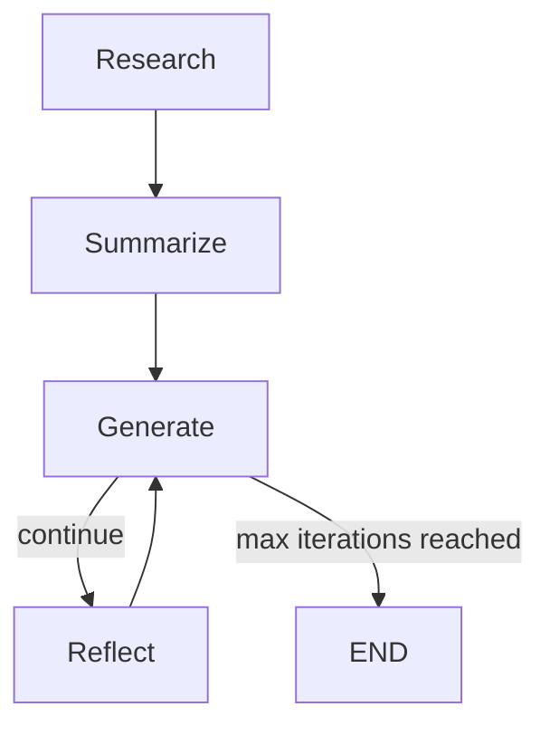
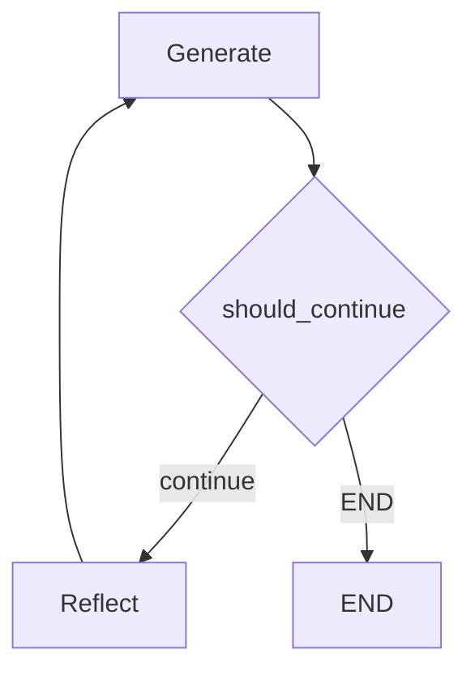

# Lang_graph_basics

A small LangGraph-based project for iterative, ATS-aware resume rewriting with LLMs.

## What Is Implemented

Inside Basic_reflection_system, the active pipeline now includes:

1. Research node
2. Summarize node
3. Generate node
4. Reflect node with conditional loop and stop condition

Current graph shape:

Research -> Summarize -> Generate -> (Reflect -> Generate)* -> END

The loop continues until max iterations is reached.

## Graph Diagram



## Routing Diagram



## Project Structure

- Basic_reflection_system/basic.py: graph state, nodes, routing, execution
- Basic_reflection_system/chains.py: prompt templates and LLM chains
- requirements.txt: Python dependencies
- react_agent_basic.py: separate example script
- Reflection_agent.py: separate reflection-related script

## Core Architecture (Basic_reflection_system)

### State

GraphState stores:

- summarize: summary/writing brief output
- research_brief: research analysis output
- current_draft: generated resume draft
- critique: reviewer feedback
- iterations: loop counter
- chat_history: running message thread used by all nodes

### Nodes

- research_node: invokes research_chain on current message context
- summarize_node: invokes summarize_chain to distill research into a compact writing brief
- generate_node: invokes generation_chain to produce/revise draft
- reflect_node: invokes reflection_chain and feeds critique back into the loop

### Routing

- Entry point: research
- Edges: research -> summarize -> generate
- Conditional edge from generate:
  - continue -> reflect
  - END -> END
- Edge: reflect -> generate

Stopping logic is handled by should_continue using a max iteration threshold.

## Prompt/Chain Design

In Basic_reflection_system/chains.py:

- generation_prompt emphasizes using writing brief first, research as support, and no fabrication
- reflection_prompt critiques draft quality against job description
- research_prompt creates a structured evidence-focused brief
- summarize_prompt compresses research into generation-ready instructions

Each prompt is paired with OllamaLLM(model="llama3") and StrOutputParser.

## Setup

1. Create and activate a virtual environment.
2. Install dependencies:

```bash
pip install -r requirements.txt
```

3. Ensure Ollama is installed and llama3 is available locally.
4. Create a .env file if needed for your environment.

## Run

From Basic_reflection_system folder:

```bash
python basic.py Resume.pdf
```

Then paste the job description into stdin and finish input.

On Windows terminal, end input with Ctrl+Z then Enter.

## Notes

- The script currently builds PDF path using an absolute Windows base path in basic.py.
- For portability, convert to relative path resolution with os.path.dirname(__file__) in a future cleanup.
- There are a few unused imports in basic.py that are non-blocking but can be removed.

## Next Improvements

1. Add explicit failure-aware retry branches (exception-driven retries).
2. Add quality-based conditional routing after summarize.
3. Add tests for node outputs and routing behavior.
4. Replace hardcoded paths with repo-relative paths.
